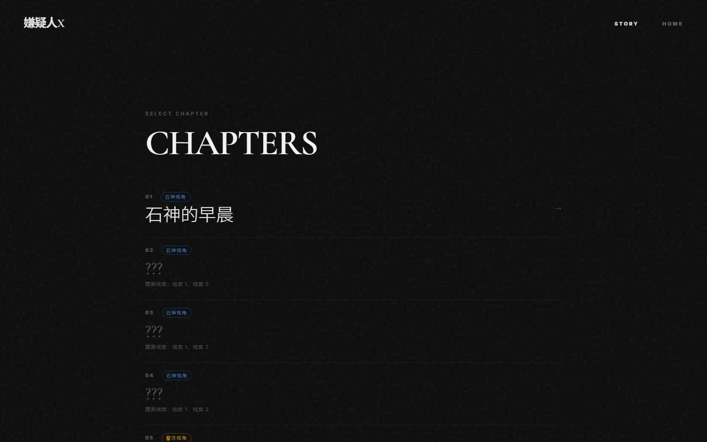

# 嫌疑人X的献身 — 交互式推理阅读 / Suspect X: Interactive Mystery Reader

**中文** | [English](#english)

一个基于东野圭吾小说《嫌疑人X的献身》的沉浸式交互推理阅读体验。通过逐段滚动揭示、线索收集、章节解锁等机制，让读者以侦探的视角参与故事。

基于《嫌疑人X的献身》的交互式推理小说阅读器，包含 9 个章节、60 张电影感插画、线索收集与章节解锁系统。

## 在线体验

- GitHub Pages: https://ballcard.github.io/suspect-x-reader/
- 国内友好版: https://y7gcnzqkrh.coze.site/

> 如果在微信内置浏览器中加载较慢，建议复制链接到系统浏览器打开。


## 特性

- **逐段揭示阅读** — 滚动或按键逐步展开故事，营造悬疑节奏
- **线索收集系统** — 阅读过程中自动发现线索，收集关键证据
- **章节解锁** — 需要特定线索才能解锁下一章节
- **60 张电影感插画** — 冷灰蓝色调写实数字绘画，配合每个关键场景
- **阅读进度追踪** — 顶部进度条 + 本地存储自动保存
- **双视角叙事** — 石神视角（蓝色）与警方视角（金色）交替推进
- **暗色主题** — 精心设计的排版与动效



## 技术栈

- React + TypeScript
- Tailwind CSS
- Framer Motion (motion/react)
- Vite

## 本地运行

```bash
npm install
npm run dev
```

打开浏览器访问 `http://localhost:3000`


## 项目结构

```
src/
├── App.tsx                    # 主应用：路由、导航、状态管理
├── components/
│   ├── ReadingView.tsx        # 阅读界面：滚动揭示、线索触发、进度条
│   ├── ChapterSelector.tsx    # 章节选择器：解锁状态、线索需求
│   └── CluePanel.tsx          # 线索面板：证据收集总览
├── data/
│   ├── chapters.ts            # 9章段落内容 + 36条线索定义
│   └── images.ts              # 60张图片→段落映射
├── hooks/
│   └── useProgress.ts         # 进度持久化 (localStorage)
└── types/
    └── story.ts               # TypeScript 类型定义
```

## 操作方式

| 操作 | 效果 |
|------|------|
| 滚动到底部 | 加载下一段 |
| 空格 / 回车 | 加载下一段 |
| 点击 Scroll 提示 | 加载下一段 |
| 右下角线索按钮 | 打开线索面板 |
| 悬停图片 | 从灰度变为彩色 |

---

<a id="english"></a>

# Suspect X: Interactive Mystery Reader

**English** | [中文](#)

An immersive interactive reading experience based on Keigo Higashino's novel *The Devotion of Suspect X*. Features progressive paragraph reveal, clue collection, chapter unlocking, and 60 cinematic illustrations.

## Live Demo

- GitHub Pages: https://ballcard.github.io/suspect-x-reader/
- China-friendly mirror: https://y7gcnzqkrh.coze.site/

If the in-app browser loads slowly, copy the link and open it in a regular browser.


## Features

- **Progressive reveal reading** — Scroll or press keys to unfold the story at a suspenseful pace
- **Clue collection system** — Discover clues automatically while reading, gather key evidence
- **Chapter unlocking** — Specific clues required to unlock the next chapter
- **60 cinematic illustrations** — Muted cool-tone photorealistic digital paintings for every key scene
- **Reading progress tracking** — Top progress bar + auto-save via localStorage
- **Dual perspective narrative** — Alternates between Ishigami's view (blue) and police view (gold)
- **Dark theme** — Carefully crafted typography and motion design


## Tech Stack

- React + TypeScript
- Tailwind CSS
- Framer Motion (motion/react)
- Vite

## Run Locally

```bash
npm install
npm run dev
```

Open `http://localhost:3000` in your browser.


## Controls

| Input | Action |
|-------|--------|
| Scroll to bottom | Reveal next paragraph |
| Space / Enter | Reveal next paragraph |
| Click Scroll hint | Reveal next paragraph |
| Bottom-right clue button | Open clue panel |
| Hover on image | Grayscale → color |
